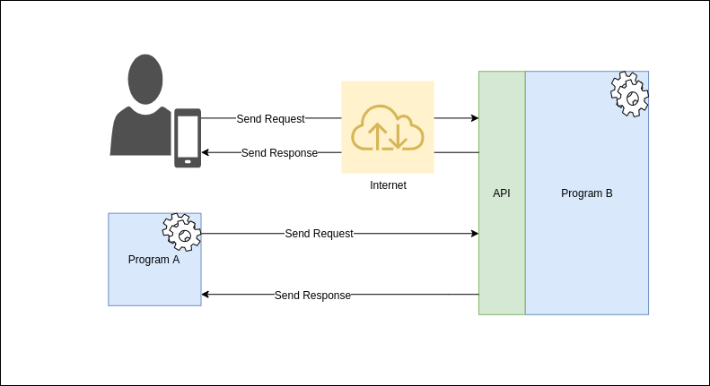

<link  href="standasrds.css"  rel="stylesheet"></link>

  

# What is an API?

  

## API definition

  

**API** stands for Application Programming Interface and describes how to interact with a program.

  

This can be seen as some form of contract that specifies that if you provide a program with certain inputs it will provide the relevant output as a response.

  

A program that is exposed via an API can be called by other programs on the same network. For example if you have a batch job running in your environment where **Program A** needs some data from **Program B**.

  

If the API for **Program B** is exposed over the internet it will allow users and other systems to gain access to the data it provides.

For example if a user installs and uses a app on their mobile phone and this app needs to access **Program B** to get some data.



  

From the above examples we can see that API's have the following 3 important characteristics:

 - Standard web protocols
 - Well defined interfaces
 - Network accessible

  

## Different types of API's
  
  

### SOAP APIs

### RESTFUL APIs

### Websocket APIs

### GraphQL APIs

  

These documents will of type "Markdown". Markdown was chosen because it offers the versatility to convert the document into several different types, such as PDF, HTML etc. If you would like a more detailed overview of Markdown, you can visit [markdownguide.org/getting-started/](https://www.markdownguide.org/getting-started/)

  

If you are new to Markdown, [this](https://github.com/adam-p/markdown-here/wiki/Markdown-Cheatsheet) cheatsheet will be very useful while creating documents similar to this one.

  

### Paragraphs and Headers

  

For the main header in the document, the document name, the H1 header type should be used, which is specified in markdown by the use of one "hashtag" and a space before the title of the document. For all other paragraphs the H3 header type will be used, by using three "hashtags" and a space before the title of the paragraph.

  

### Tables

  

Below is an example table that should be used as the standards for tables in all other documents.

  

| Column 1 | Column 2 | Column 2 |

| ----- |:------------------ | ---------:|

| 10000 | xxxxxxxx | $1600 |

| 20000 | yyyyyyyy | $12 |

| 00000 | zzzzzzzz | $1 |

  

In a table, all text should be left aligned and all numbers and currency values right aligned.

  

### Lists

  

There are two types of lists at your disposal in markdown, ordered lists and unordered lists. Ordered lists make use of numbers, as shown below:

  

1. This is the first item in the list.

2. The second item is here.

* This is an unsorted sub-list.

3. This is the third item.

  

The other option is an unsorted list, which is shown below:

  

* First item in the unsorted list specified by using an asterisk.

* Second item, can also be specified using a minus.

  

### Images

  

Markdown supports the use of images, they can be added using either the inline style or the reference style:

  

#### Inline Style

  


  

#### Reference Style

  

![alt text][logo]

  

[logo]: https://github.com/adam-p/markdown-here/raw/master/src/common/images/icon48.png  "This logo was added using reference style"

  

These end product of these two look the same, the markdown however is different. The reference style is suitable for use when you intend on using the same image several times throughout the document.

  

### Code Snippets

  

Markdown supports syntax highlighting for javascript and python, other code snippets can be surrounded using fenced code blocks, however there will be no syntax highlighting.

  

#### JavaScript

  

```javascript

var  s = "JavaScript syntax highlighting";

alert(s);

```

  

#### Python

  

```python

s = "Python syntax highlighting"

print s

```

  

#### No Language Indicated

  

```nolanguage

No language indicated, so no syntax highlighting.

But let's throw in a <b>tag</b>.

```

  

### CSS

  

CSS can be used for styling the document, you can either use inline styling, this is most suited when the styling will be used at a few places. The preferred method of css styling would be to use a CSS file, the css file specified in this document, should be used as a base for all other documents.

  

#### Specifying the CSS file

  

The line specified below should be added to the top of your markdown file, with the correct path to the css file.

  

```html

<link  href="standards.css"  rel="stylesheet"></link>

```

  

#### Inline CSS

  

If you would like to add inline CSS to a markdown file, it can be done with the method specified below.

  

```html

<style  type="text/css"  rel="stylesheet">

h1 { color: red; }

</style>

```

  

### Visual Studio Code

  

It is suggested that Visual Studio Code is used to create these markdown documents, with the following Extensions downloaded and enabled:

  

* Markdown All in One

* Markdown PDF

* markdownlint

  

In order to export the markdown file to the required file format, follow the below instructions inside VS Code:

  

1. Press "ctrl" + "p"

2. Type ">markdown pdf"

3. A list of options will be available, select the option you require and press "Enter"

  

### Header and Footer Settings

  

Header and footer settings for the markdown pdf extension can be set by adding them to the user's settings.json file in VS Code, as shown below:

  

```json

{

"markdown-pdf.headerTemplate": "<div style=\"font-size: 9px; margin-left: 1cm;\"> <span class='title'></span></div> <div style=\"font-size: 9px; margin-left: auto; margin-right: 1cm; \"> <span class='date'></span></div>",

"markdown-pdf.footerTemplate": "<div style=\"font-size: 9px; margin: 0 auto;\"> <span class='pageNumber'></span> / <span class='totalPages'></span></div>"

}

```